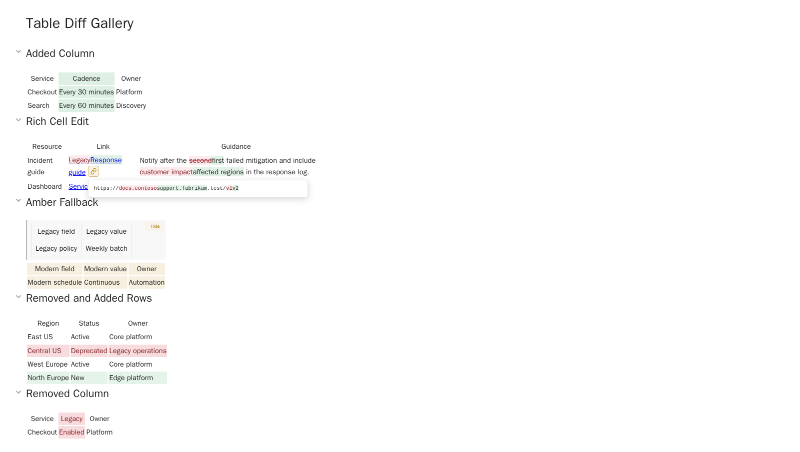

# Easy Markdown Review

[](https://github.com/shudv/easy-markdown-review-ado/actions/workflows/ci.yml)
[](https://github.com/shudv/easy-markdown-review-ado/releases/latest)
[](LICENSE)

Review Markdown like a document, directly in Azure DevOps. Comment on rendered
content, understand structural changes at a glance, and keep Git as the source of
truth.



## Features

- **Comment where you read.** Review rendered Markdown and leave anchored
  pull-request comments directly on the words that need attention.
- **See meaningful changes.** Semantic diffs surface structural edits—including
  added or deleted table columns and changed links—without raw line noise.
- **Give documents a proper home.** The Documents hub brings repository docs
  together with a more polished commenting experience than the native Azure
  DevOps wiki.

## Get started

1. [Install Easy Markdown Review from the Azure DevOps
   Marketplace](https://marketplace.visualstudio.com/items?itemName=ShubhamDwivedi.emr).
2. Open **Markdown Review** on a pull request that changes a `.md` file, or open
   **Documents** from the project navigation.
3. Select rendered text to comment, or turn on diffs to review semantic changes.

## A note on code quality

I built this because I needed it—and because I wanted to see how far agentic
coding could take a real problem. Most of the codebase is agent-generated, so
some slop is expected.

The guardrails are intentionally strict: CI enforces 100% statement and branch
coverage; tests exercise behavior through public surfaces rather than reaching
into private members; mutation testing must stay at or above 85%; 26 curated
end-to-end tests cover the Azure DevOps integration boundary; and multiple
visual regression tests protect the UI. The extension is also used daily by
1,000+ Microsoft engineers. That is meaningful evidence, but it is not enough.
Quality and stability will keep improving as time allows, and contributions are
welcome.

## Contributing

Requires Node.js 24+:

```powershell
npm install
npm run typecheck
npm test
```

See the [sandbox setup](sandbox/README.md), [end-to-end test
guide](e2e/README.md), and [visual regression guide](visual/README.md) for the
relevant development workflows. Pull requests are welcome.

## Security

Please report vulnerabilities privately through the [security
policy](SECURITY.md). The [threat model](docs/threat-model.md) documents the
extension's trust boundaries.
