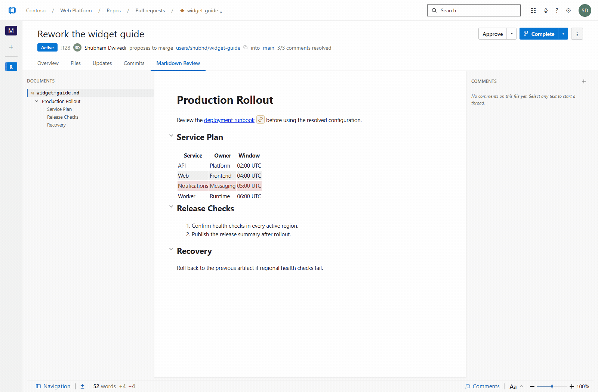

# Easy Markdown Review

Review and edit Markdown like a Word doc, right inside Azure DevOps — while keeping Git as the source of truth. **Reviewers** comment on the **rendered** page (not the raw diff), comments live as pull-request threads, and design docs get a home that lives between commits.



> Prefer video? A higher-resolution [`assets/showcase.mp4`](assets/showcase.mp4) is generated alongside the GIF — run `npm run gif:showcase` to rebuild both.

> Status: shipping in the Marketplace — rendered-prose PR comments, Mermaid diagrams, diff highlighting, cross-PR comment history, and a project-wide Documents hub are all live.

## What it does

- **Markdown Review tab on every PR** — adds a tab to any pull request that touches a `.md` file, rendering content at the PR's source commit through a `unified`/`remark`/`rehype` pipeline.
- **Comment on rendered prose** — highlight text on the rendered page and drop a **document-style** comment on it, margin-anchored the way Word/Office comments are. Threads anchor via W3C `TextQuoteSelector`s, so they survive small edits and rewordings.
- **See what changed** — added / modified / removed content is highlighted inline on the rendered page.
- **Mermaid diagrams** — both GitHub <code>\`\`\`mermaid</code> and Azure DevOps `:::mermaid` fences render inline, with a "view source" affordance.
- **Navigable mentions** — `@users`, `#work-items`, and `!pull-requests` become real clickable links.
- **Live thread sync** — new comments from teammates appear without a reload.
- **Documents hub** — a top-level hub listing every Markdown file across the project; **comment on any doc without opening a pull request**, so review isn't tied to a code-review cycle.
- **No new infrastructure** — comments persist as Azure DevOps PR comment threads: no sidecar storage, no new identity, no extra permissions.
- **Theme-aware** — light/dark follow the Azure DevOps host theme.

---

## Setup

All values are placeholders — nothing is tied to a specific ADO org. Replace `<your-org>`, `<your-project>`, `<your-publisher-id>`.

### Prerequisites

- Node 20+, npm 10+ (Node 22/24 verified).
- Real-PR path only: an ADO org you own (`https://dev.azure.com/<your-org>`), a PAT with the scopes in [`.env.example`](.env.example), and a free [Marketplace publisher](https://aka.ms/vsmarketplace-manage-publishers).

### Install

```PowerShell
npm install
```

### Path B — Real PR install

1. **`.env`** — `Copy-Item .env.example .env`, then set `AZDO_ORG_URL`, `AZDO_PAT`, `AZDO_TEST_PROJECT`. (`.env` and `.ado-sandbox.json` are gitignored.)

2. **Sandbox** — provision repos/PRs/threads from [`sandbox/`](sandbox/README.md):

   ```PowerShell
   npm run setup:sandbox      # idempotent
   npm run verify:ado         # validate PAT + IDs
   ```

   IDs and PR URLs (pointing at your org) are written to `.ado-sandbox.json`.

3. **Cert** — `npm run setup:cert` (per-machine HTTPS cert under `certs/`, gitignored).

4. **Server** — `npm run dev:https`, then open `https://localhost:3000` once and accept the cert (page is blank by design).

5. **Publisher** (once) — create at <https://aka.ms/vsmarketplace-manage-publishers>, then set `AZDO_PUBLISHER_ID` in `.env`. The id becomes part of the extension key and can't be changed.

6. **Package + install** (once):

   ```PowerShell
   npm run package:dev        # → build/<your-publisher-id>.emr-dev-<ts>.vsix
   ```

   At `https://marketplace.visualstudio.com/manage/publishers/<your-publisher-id>`: **New extension → Azure DevOps** → upload the `.vsix` → right-click → **Share/Unshare** → add `<your-org>`. Then in ADO: **Organization settings → Extensions → Shared** → install.

7. **Inner loop** — edit `src/`; HMR pushes the bundle into the open PR tab. No re-package.

### Scripts

| Script                                  | Does                                                                    |
| --------------------------------------- | ----------------------------------------------------------------------- |
| `dev` / `dev:https`                     | webpack-dev-server on `http://`/`https://localhost:3000` (HMR).         |
| `setup:sandbox` / `verify:ado`          | Provision / validate the ADO sandbox.                                   |
| `setup:cert`                            | Generate the local HTTPS cert.                                          |
| `build` / `build:dev`                   | Production / development webpack build.                                 |
| `package:dev`                           | Build a `.vsix`.                                                        |
| `typecheck`                             | `tsc --noEmit`.                                                         |
| `test` / `test:watch` / `test:coverage` | Vitest (coverage enforces 90% lines/stmts/fns, 80% branches).           |
| `e2e`                                   | Playwright tests.                                                       |
| `test:visual` / `test:visual:update`    | Curated Storybook screenshot regression suite (see `visual/README.md`). |
| `clean`                                 | Remove `dist/` and `build/`.                                            |

---

## Releases

GitHub Actions validates every pull request and push to `main`. Publishing is
triggered by publishing a non-prerelease GitHub Release and uses the source at
that release tag.

Repository administrators must configure:

- The Actions variable `AZDO_PUBLISHER_ID` with the Marketplace publisher ID.
- The Actions secret `AZDO_MARKETPLACE_PAT` with a PAT scoped to Marketplace
  **Acquire & Manage** for that publisher.

The release workflow packages a public VSIX, publishes it to Azure DevOps
Marketplace, and attaches the same VSIX to the GitHub Release.

---

## Architecture notes

### Rendering pipeline

`src/markdown/render.ts` runs:

```
remark-parse → remark-gfm → remark-rehype (allowDangerousHtml: false)
            → rehypeSourcePositions     (custom — data-source-line attrs)
            → rehypeMentions            (custom — mention:// rewriting)
            → rehypeCollapsibleSections (custom — wraps headings in <section>)
            → rehypeSanitizeUrls        (custom — href/src scheme allowlist)
            → rehype-stringify
```

`rehypeSourcePositions` adds `data-source-line` / `data-source-end-line` to every element so the anchor layer can map rendered HTML back to source lines without extra DOM wrappers.

Raw HTML is not passed through (`allowDangerousHtml: false`), and `rehypeSanitizeUrls` enforces a per-tag URL scheme allowlist on `<a href>`/``, stripping `javascript:`, `data:`, `file:`, etc. See [docs/threat-model.md](docs/threat-model.md).

### Why no sidecar database

ADO PR threads already provide stable ids, a free-form `properties` bag for anchor metadata, and org-level RBAC/audit/notifications. Using them as the only persistence layer means zero infra, zero new identity surface, and zero migration if Microsoft ships a similar feature.

---

## Troubleshooting

- **`ERR_CERT_AUTHORITY_INVALID`** **/ blank tab in ADO** — run `npm run setup:cert`, visit `https://localhost:3000` once, accept the cert.
- **Webpack entry/plugin changes ignored** — the dev server doesn't reload `webpack.config.cjs`; restart it.

---

## Security

The extension renders untrusted Markdown (PR content + comment bodies) inside an iframe holding an ADO host session token.

- [docs/threat-model.md](docs/threat-model.md) — STRIDE analysis and trust boundaries.
- [SECURITY.md](SECURITY.md) — private disclosure process and SLAs.

Found a security issue? Don't open a public issue — see [SECURITY.md](SECURITY.md).
