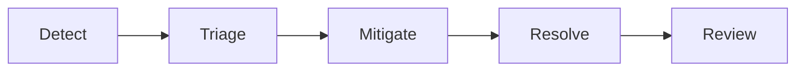

# Customer Incident Response Guidelines

These guidelines describe how an on-call engineer should approach a customer-impacting incident, from the first page to the final review.

## When to declare an incident

Declare an incident whenever customer-visible behaviour breaches an SLO or a customer reports impact we can reproduce.

If you are unsure, declare — a quick stand-down is cheaper than a late start.

## Severity levels

Severity is set by customer impact, not by how hard the fix is.

| Severity | Impact | Ack target | Update cadence |
| --- | --- | --- | --- |
| Sev 1 | Broad outage, revenue-impacting | 5 min | 30 min |
| Sev 2 | Major feature down for many customers | 15 min | 60 min |
| Sev 3 | Degraded experience, workaround exists | 30 min | daily |
| Sev 4 | Minor or cosmetic | next business day | none |

## Response lifecycle

Every incident moves through the same phases.

## Roles

- **Incident commander** owns the response and makes the call on mitigation.
- **Communications lead** owns customer and stakeholder updates.
- **Subject-matter experts** are pulled in as the investigation narrows.

## Communication

Post the first customer update within the ack target for the severity.

## Legacy paging policy

The old policy paged the whole team on every Sev 3. This is deprecated and will be removed once the new rotation is in place.

## Escalation

If the incident commander cannot mitigate within one update cadence, escalate to the service owner.

## After the incident

Write a blameless post-incident review within three business days.
