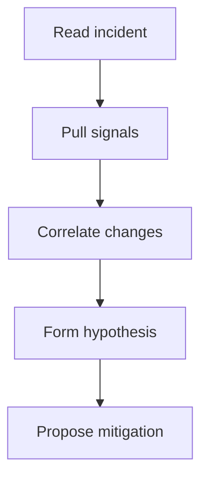

# ICM Investigation

This skill helps an on-call engineer investigate an IcM incident by gathering the signals a human would collect by hand.

For the human process this automates, see the Customer Incident Response Guidelines.

## When to use this skill

Use this skill when you are given an IcM incident ID, a Sev level, or a customer-impact alert and you need a working hypothesis fast.

## Inputs

| Input | Required | Notes |
| --- | --- | --- |
| Incident ID | yes | The IcM incident to investigate. |
| Service name | yes | The impacted service. |
| Time window | no | Defaults to the last 60 minutes. |

## Investigation workflow

## Steps

1. Read the incident summary and confirm the reported impact.
2. Pull the service health signals for the time window.
3. List deployments and config changes in the same window.
4. Correlate the onset of impact with the change timeline.
5. Propose the smallest safe mitigation and hand back to the engineer.

## Manual fallback

If the telemetry API is unavailable, read the last hour of the error-rate and latency charts by hand. This fallback is slow, so avoid it unless the API is down.

## Output

Return a short investigation note with the confirmed impact, the leading hypothesis, and the proposed mitigation.

## Safety

This skill never applies a mitigation on its own. It proposes; a human decides.
