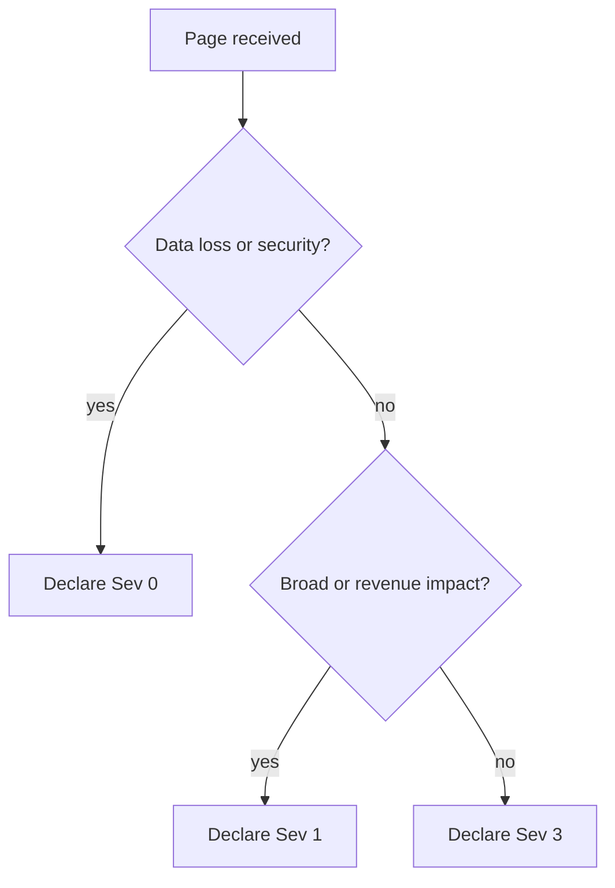
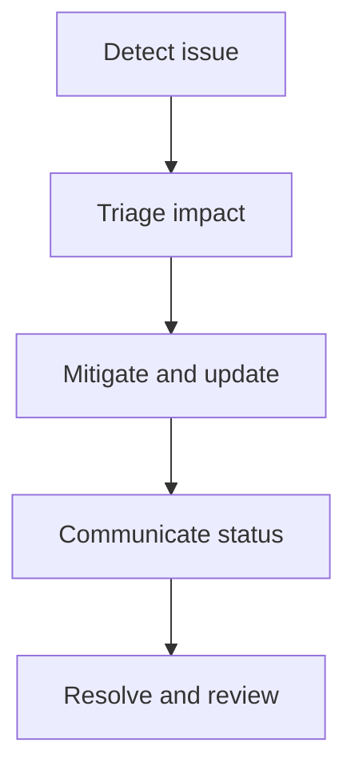
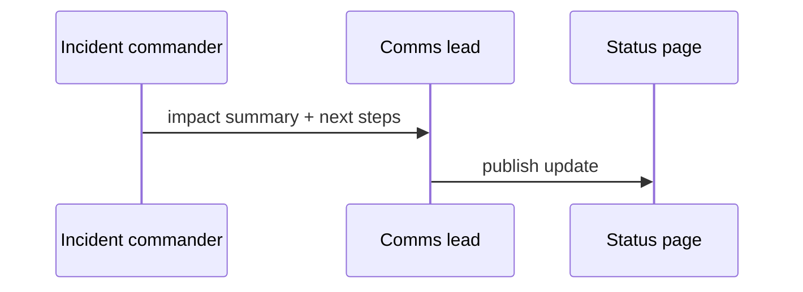

# Customer Incident Response Guidelines

These guidelines describe how to run a customer-impacting incident from the first page to the final review, with the [ICM investigation skill](../skills/icm-investigation/SKILL.md) automating the triage steps.

## When to declare an incident

Declare an incident whenever customer-visible behaviour breaches an SLO or a customer reports impact we can reproduce.

If you are unsure, declare — a stand-down is cheaper than a late page.

## Severity levels

Severity is set by customer impact, not by how hard the fix is.

| Severity | Impact | Ack target | Update cadence |
| --- | --- | --- | --- |
| Sev 0 | Confirmed data loss or security breach | 5 min | 15 min |
| Sev 1 | Broad outage, revenue-impacting | 5 min | 30 min |
| Sev 2 | Major feature down for many customers | 15 min | 45 min |
| Sev 3 | Degraded experience, workaround exists | 30 min | daily |
| Sev 4 | Minor or cosmetic | next business day | none |

## Triage decision tree

Use this to pick a starting severity within the first few minutes.



## Response lifecycle

Every incident moves through the same phases.



## Roles

- **Incident commander** owns the response and makes the final call.
- **Communications lead** owns customer and stakeholder updates.
- **Scribe** keeps the incident timeline so the review is not reconstructed from memory.
- **Subject-matter experts** are pulled in as the investigation narrows.

## Communication

Post the first customer update within the ack target for the severity.

## Escalation

If the incident commander cannot mitigate within one update cadence, escalate to the service owner.

## After the incident

Write a blameless post-incident review within three business days.

## Communication templates

Use these when you publish an update so the customer message stays consistent.



Paste this skeleton into the status page:

```text
[Sev {level}] {service} — {short impact statement}
Started: {timestamp}   Next update: {timestamp}
```
