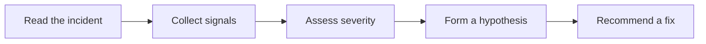

# ICM Investigation

This skill helps an on-call engineer investigate an IcM incident by gathering the signals a human would collect by hand.

For the process behind it, see the [Customer Incident Response Guidelines](../../guidelines/incident-response.md).

## When to use this skill

Use this skill when you are given an IcM incident ID, a Sev level, or a customer-impact alert and you need a working hypothesis fast.

## Inputs

| Input | Required | Notes |
| --- | --- | --- |
| Incident ID | yes | The IcM incident to triage, e.g. 480215. |
| Service name | yes | The impacted service. |
| Severity | no | If omitted, the skill proposes one from impact. |
| Time window | no | Defaults to the last 60 minutes. |

## Data sources

The skill reads these before forming a hypothesis.

| Source | Signal | Used for |
| --- | --- | --- |
| Service health | Error rate, latency | Confirming impact |
| Deployment log | Recent rollouts | Change correlation |
| Config store | Flag and setting flips | Change correlation |

A typical signal query looks like this:

```kusto
Traces
| where Timestamp > ago(30m)
| where Service == "checkout"
| summarize errors = countif(Level == "Error") by bin(Timestamp, 1m)
```

## Investigation workflow



## Steps

1. Read the incident summary and confirm the impact and the customer.
2. Pull the service health signals for the time window.
3. List deployments and config changes in the same window.
4. Correlate the onset of impact with the change timeline.
5. Propose the smallest safe mitigation and hand back to the engineer.

## Output

Return a short investigation note with the confirmed impact, the leading hypothesis, and the proposed mitigation.

## Safety

This skill never applies a mitigation on its own. It proposes; a human decides.
