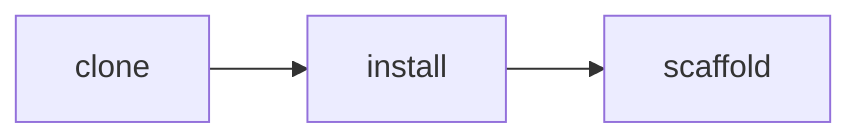
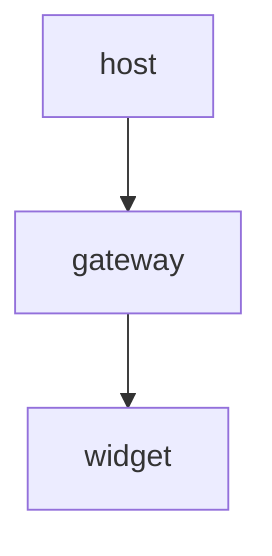

# Widget Platform Guide

## Introduction and Overview

Widgets are small, reusable UI components that render inside any host page. This guide is aimed at new contributors.

Every widget ships as a self-contained bundle.

## Prerequisites

Before you begin, make sure you have Node 20+ and the `widget-cli` tool installed globally.



## Installation

Download the installer from the internal feed and run it. Installation usually takes a couple of minutes and requires no elevated permissions.

## Quick Start

Scaffold a project and start the dev server in one step:

```bash
widget new my-widget && cd my-widget && widget dev
```

## Configuration

Edit `widget.config.json` to set your preferences. The default values work for most teams.

### Core Configuration Options

| Option | Default | Description |
| --- | --- | --- |
| `theme` | `auto` | Colour scheme for the widget shell. |
| `retries` | `3` | Load retries before failing. |
| `timeout` | `5000` | Load timeout in milliseconds. |

### Status Codes

| Code | Retry | Meaning |
| --- | --- | --- |
| 200 | no | The widget loaded successfully. |
| 429 | backoff | Rate limited; back off and retry. |
| 500 | immediate | Server error; retry with jitter. |
| 503 | yes | Service unavailable; retry later. |
| 504 | yes | Gateway timeout; retry after a short delay. |

## Architecture

The renderer talks to the host through a small message bus.



## Lifecycle

A widget moves through four phases during its life.

- `init` boots the host iframe and injects the resolved configuration.
- `mount` renders the widget and requests its data.
- `refresh` re-fetches data whenever the widget becomes visible again.
- `teardown` releases resources when the host unmounts.

### Startup Sequence

1. Validate the widget manifest and its declared permissions up front.
2. Allocate a sandboxed iframe for the widget to run in.
3. Inject the configuration payload into the frame.
4. Emit the ready event once the first paint completes.

### Deployment Regions

- Americas
  - us-east
  - us-west-2
- Europe
  - eu-west

### Release Checklist

- [x] Run the full test suite
- [ ] Update the changelog
- [ ] Tag the release

> Note: the host may skip teardown on a hard navigation, so never rely on it for cleanup.

## Troubleshooting

If a widget fails to load, open the browser console and check the network tab, then cross-check the failing request against the build manifest for a stale hash.

## Diff Confidence Cases

Each example below changes one block while the surrounding headings and control sentences remain stable.

### Wholesale Rewrite

Production traffic now follows a staged regional rollout with automated health gates.

This control sentence separates the paragraph rewrite from the next case.

### Reconstructed Hard Wrap

The deployment guide keeps this opening phrase and now recommends
the staged verification path for regional rollouts while preserving
the final rollback checklist for operators.

This control sentence separates the hard-wrapped paragraph from the next case.

### Heading Level Change

##### Approval workflow

This control sentence separates the heading change from the next case.

### List Type Change

- Preserve customer context through the handoff.

This control sentence separates the list change from the next case.

### Quote Rewrite

> Escalate after the first failed mitigation and page the regional owner.

This control sentence separates the quote rewrite from the next case.

### Code Edit

```ts
const timeout = 30;
```

This control sentence separates the code edit from the next case.

### Code Rewrite

```powershell
Invoke-RestMethod $healthEndpoint
```

This control sentence separates the code rewrite from the next case.

### Link Wrapping

Read the [deployment guide](https://example.com/deployment) before continuing.

This control sentence separates the link change from the next case.

### Titled Link Wrapping

Open the [incident guide](https://example.com/incidents "Incident response guide") before mitigation.

This control sentence separates the titled link from the next case.

### Long Link Destination

Review the [regional deployment matrix](https://example.com/platform/deployments/regions/primary/secondary/canary/rings/validation/health/checks/owners/approvals/matrix) before rollout.

This control sentence separates the long link from the next case.

### Nested Formatting and Link

Read the [**deployment guide**](https://example.com/deployment/approval) before approval.

This control sentence separates nested formatting from the next case.

### Link Removal

Open the legacy runbook before continuing.

This control sentence separates link removal from the next case.

### Combined Marker and Checklist State

- [x] Confirm the release owner.

This control sentence separates the combined structural change from the next case.

### Formatting Only

The **release owner** confirms the deployment window.

## Support

Reach the platform team at widgets@example.com for anything not covered here.
