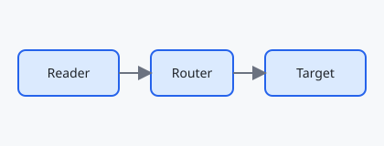

# Getting Started

Follow the guides in order — each one links to the next.

## Install

See the [installation guide](guides/install.md) in the `guides` subfolder.

## Configure

Then read the [configuration guide](guides/configure.md), and skim the
[API reference](reference/api.md).

## Back

Return to the [repository README](../README.md) one level up, or jump to
[Install](#install) on this page.

The [architecture diagram](../assets/architecture.svg) is a non-Markdown file.

