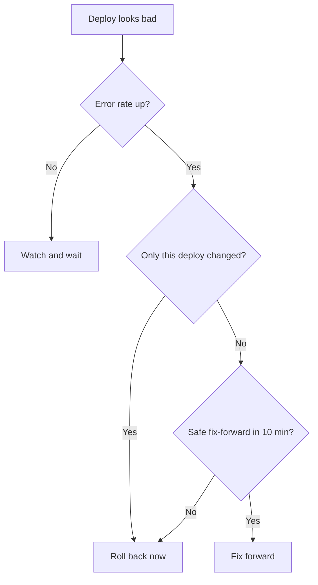

# Deploy rollback

## When to roll back

Roll back if a deploy correlates with elevated error rates, latency, or a feature
regression and you cannot identify a safe fix-forward within 10 minutes.

## Decision tree

## Steps

1. Identify the last known-good revision.
2. Trigger the rollback pipeline targeting that revision.
3. Watch error rate and latency return to baseline.
4. Note the bad revision in the incident channel so nobody re-deploys it.

## After

File a ticket to root-cause the bad deploy before re-attempting.
