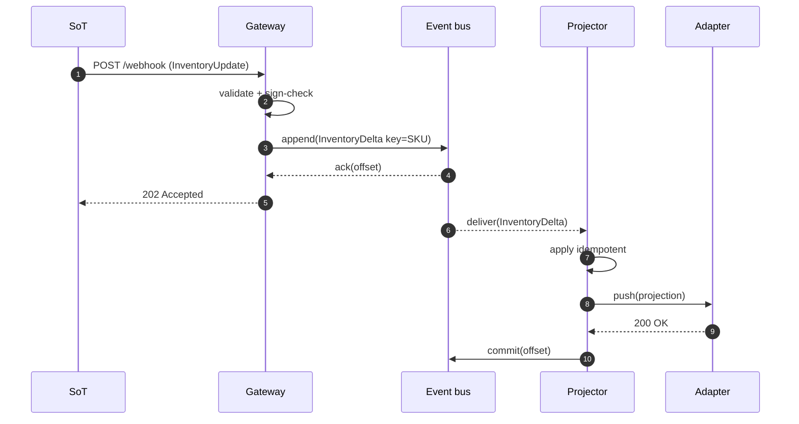

# Write path

This document traces a single inventory update from the source of truth to a
marketplace, calling out every durability and ordering decision.

## Actors

- **Source of truth (SoT):** the canonical inventory store.
- **Gateway:** validates and admits.
- **Bus:** durable ordered log.
- **Projector:** materializes and pushes.
- **Marketplace adapter:** speaks the marketplace's API dialect.

## Trace

## Durability checkpoints

| Step | If it crashes here | Recovery |
| --- | --- | --- |
| Before append | Source retries | No data committed |
| After append, before commit | Bus redelivers | Projector reapplies idempotently |
| After push, before commit | Bus redelivers | Push is a no-op (version guard) |
