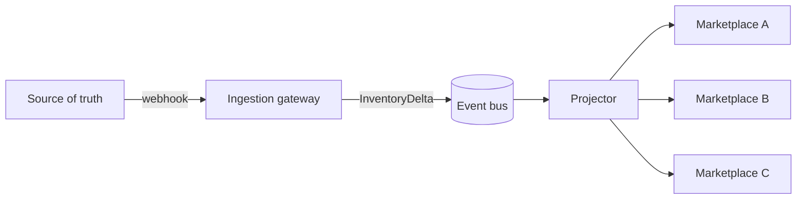
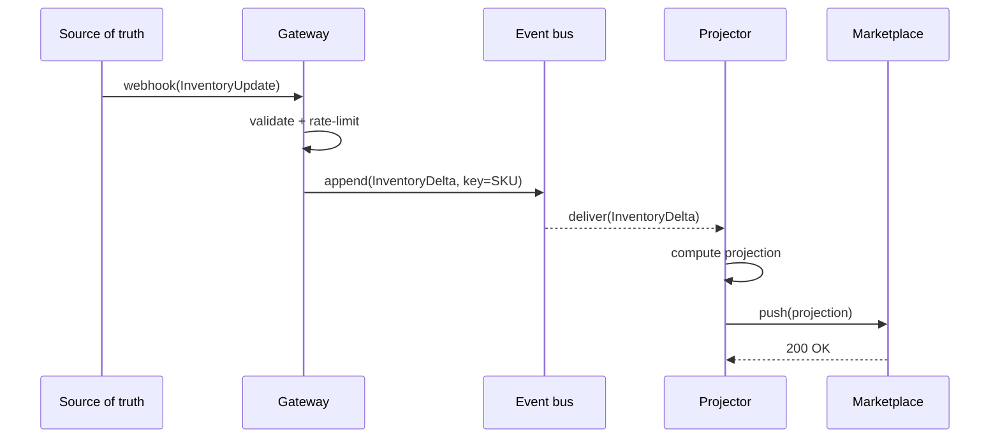
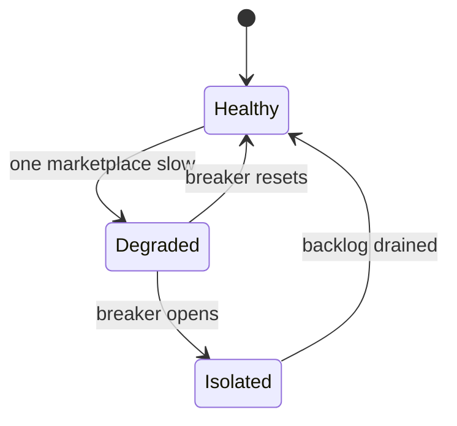

# Service X — Architecture Overview

## Context

Service X owns the synchronization pipeline for customer inventory data across
partner marketplaces. Inventory updates today arrive on a polling schedule and
can lag by several minutes, which causes oversell incidents during flash sales.

The pipeline must move a write at the source of truth to every downstream
marketplace fast enough that a shopper never sees stock that no longer exists.

## Goals

- Sub-second propagation of inventory deltas from source-of-truth to all marketplaces.
- At-least-once delivery with idempotent application at the sink.
- No partner-marketplace can block updates for any other partner.
- Operable by a two-person on-call rotation without heroics.

## Non-goals

- Replacing the source-of-truth inventory store.
- Two-way reconciliation (covered by the Reconciler service).
- Marketplace-specific business rules (owned by each adapter team).

## Architecture

### Components

The system consists of three core components, each documented in its own file:

| Component | Responsibility | Detail |
| --- | --- | --- |
| Ingestion gateway | Validate and admit writes | [services/ingestion-gateway.md](services/ingestion-gateway.md) |
| Event bus | Durable, ordered, partitioned log | [services/event-bus.md](services/event-bus.md) |
| Projector | Materialize per-marketplace views | [services/projector.md](services/projector.md) |

### High-level flow

### Write path, step by step

When a write arrives at the gateway:

1. The gateway validates the payload and rejects malformed updates synchronously.
2. The gateway emits an `InventoryDelta` event to the bus, partitioned by SKU id.
3. The projector consumes the event, computes the new per-marketplace projection,
   and writes it to the marketplace adapter's outbound queue.

A more detailed treatment lives in
[data-flows/write-path.md](data-flows/write-path.md).

### Sequence

## Capacity and SLOs

| Metric | Target | Current |
| --- | --- | --- |
| p50 propagation | < 200 ms | 4.2 min |
| p99 propagation | < 500 ms | 7.1 min |
| Delivery guarantee | at-least-once | best-effort |
| Availability | 99.95% | 99.7% |

## Failure modes

## Open questions

- How do we handle replay after an extended outage of a downstream marketplace?
- What is the retention policy on the event bus?
- Do we need per-tenant rate limiting at the gateway?
