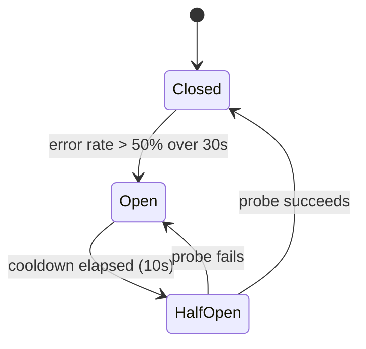

# Marketplace adapter

The adapter is the per-marketplace component that translates a projection into
the marketplace's native API calls and owns the **circuit breaker** that isolates
a failing marketplace from the rest of the fleet.

## Circuit breaker

Each marketplace has an independent breaker with three states:

- **Closed:** traffic flows normally.
- **Open:** traffic is parked on the outbound queue; no calls are made.
- **Half-open:** a single probe request tests recovery.

## Trip conditions

The breaker trips on **error rate**, not latency alone — a slow-but-succeeding
marketplace should degrade, not isolate. Latency feeds a separate concurrency
limiter.

## Backlog handling

While a breaker is open, projections accumulate on the marketplace's outbound
queue. On reset, the adapter drains oldest-first, preserving per-SKU order.
